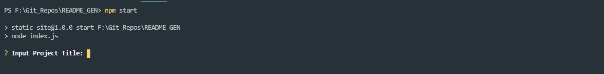
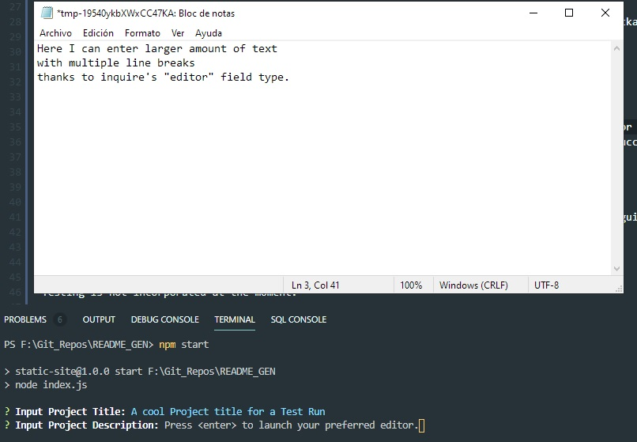
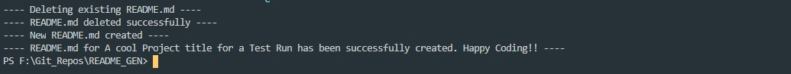

# README Generator CLI App.


## Description

When creating an open source project on GitHub, it is important to have a quality README with information about the app--what is the app for, how to use the app, how to install it, how to report issues, and how to make contributions so that other developers are more likely to use and contribute to the success of the project. This command-line application will allow for quick and easy generation of a project README to get started quickly. This will allow a project creator to spend more time working on finishing the project and less time creating a good README.

## Table of Content

- [Installation](#Installation)
- [Usage](#Usage)
- [Contributing](#Contributing)
- [Tests](#Tests)
- [License](#License)
- [Questions](#Questions)

## Installation

**Note:** Node JS is required to execute this application. [Click Here](https://nodejs.org/) to download and install Node JS.

1. Clone or copy files from this repo to your local workstation.
2. Open CLI or Terminal and browse to folder containing files of this App.
3. Execute the below command where the package.json file exists:

```
npm install
```

4. Once all required Node modules have been installed, the App is ready for execution. See below [Usage](#Usage).

## Usage

Once the app files have been downloaded and the required node modules have been installed (see [Installation](#Installation) for more details), follow below steps to execute the app:

1. Open favorite CLI or Terminal.
2. Browse the directory where the README GEN App is located.
3. Type the following command on the CLI or Terminal (run the command where the index.js and package.json files are located)

```
npm start
```

4. Above command will initiate the README GEN app. Below a screen cap of the running app.
   
5. Proceed to answer every prompted question. Some questions will open your preferred text editor to allow large text input. See below.
   
   <br>--- **Note:** Once the text is entered, proceed to close the text editor and save changes so the App captures and stores it. All questions have validation for required inputs.
6. Once all questions are answered, the app will attempt to create the README file and log success or error message to the CLI or Terminal.
   
   <br>--- **Note:** If a previous README file exists in the same directory where the app is executing, such README file will be deleted and new file will be generated with updated content.
7. Relocate the generated README file to your new project's folder.

##### Additional Usage Material -- Videos (Screencastify)

1. [Readme Generator App -- Walk-through Pt.1](https://drive.google.com/file/d/1nvz_RAecO6fW1eDt8hpLZcyb1L76fYsA/view)
2. [Readme Generator App -- Walk-through Pt.2](https://drive.google.com/file/d/1u2xOsvRGj993LnGEN9G5v3Ma38s7VD62/view)
3. [Readme Generator App -- Walk-through Pt.3](https://drive.google.com/file/d/1zeoe77JAcEN-HhFywZHzXBcYye5WL8Wk/view)
4. [Readme Generator App -- Walk-through Pt.4](https://drive.google.com/file/d/1keS7jNQ5ZV22MXhpaKCogg_mRosPZZmU/view)

## Contributing

Huge thanks to my instructors Jeff Cartagena and Molly Gilbert for sharing their knowledge and guide me to create this app.
See Questions section for contact information if interested on contributing.

## Tests

Testing is not incorporated at the moment.

## License

MIT

## Questions

Want to get in touch? Github: arielcc88

Report bugs and enhancements to: arielcc88@outlook.com
